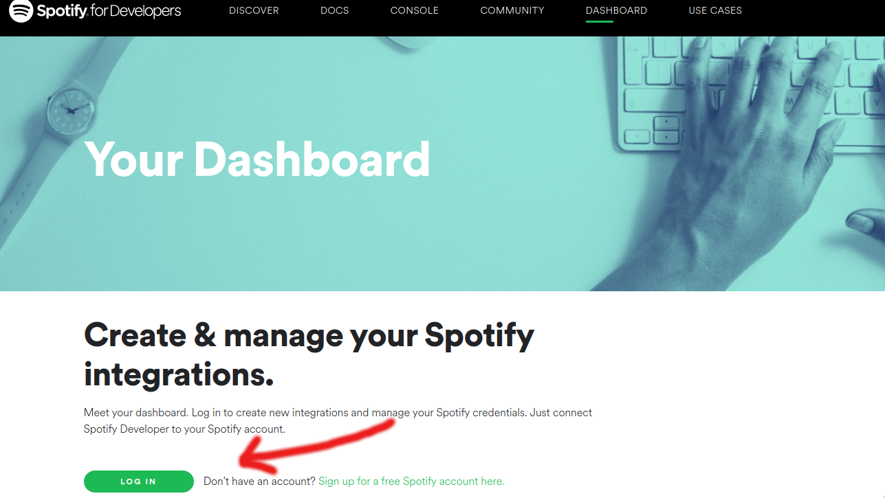
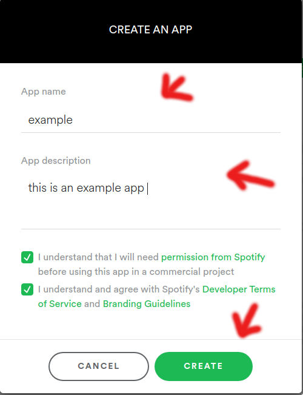

# SaveThatSong

This python script lets you:

	- Download songs from a Spotify playlist
	- Download songs from a YouTube playlist
	- Download songs from a file that has a list of songs
	- Download a song from YouTube

## Installation

### MacOS
- Clone this repository by running the command `git clone https://github.com/ArjunxyzSatish/SaveThatSong` in a terminal window.

- Navigate to the 'SaveThatSong' directory by running `cd SaveThatSong`.

- Run the MacOS install script with `bash macOS_install.sh`.

- This script installs homebrew first and installs all the required programs using homebrew (python3, ffmpeg, SaveThatSong). So it does everything for you! :D. If you would like to install this program directly from pip, you can check out the 'General' installation instructions below.

### General
- You'll first need to have Python and pip installed. Once you have that, open your terminal and type ` pip install SaveThatSong `

- You'll also need `ffmpeg` for this to work. This is what the script uses to convert the files into an mp3 format. Make sure you have that installed before running the script.

- Then to run the script, open a terminal window and type ` sts `

## How to use it

### Downloading songs from a Spotify playlist

To do this you'll first need to get your Spotify Client_ID and SECRET. You'll need a free Spotify account for this

- Log in with your Spotify account [here](https://developer.spotify.com/dashboard/) and click on 'Create an App'

	

- Then, click on 'Create an App'

	

- Enter an App Name and Description and click on 'Create App'. What you actually type into the 'App Name' and 'Description' fields doesn't really matter.

	

- You should be able to see your Client_ID and Client_SECRET on the next page.
	

- The app will ask you to enter these 2 values everytime you want to download songs from a Spotify playlist.

- This is fine but ideally, you'll want to add these as environment variables to your OS so you don't have to enter them everytime you want to use this feature. You can look up how to do this on your OS.

### Download songs from a YouTube playlist

Select option 2 from the menu and enter the link of the YouTube playlist when prompted

### Download songs from a list of songs

Make a text file and fill it with the names of the songs you want to download, one song per line. Then, choose option 3 from the main menu and enter the name of the text file, with the extension, when prompted. The script runs through the file and downloads each song that is on it from YouTube.

### Download a song from YouTube

Select option 4 from the main menu and enter the name of the song you want to download when prompted. The script then looks for this song on YouTube and downloads it for you.
